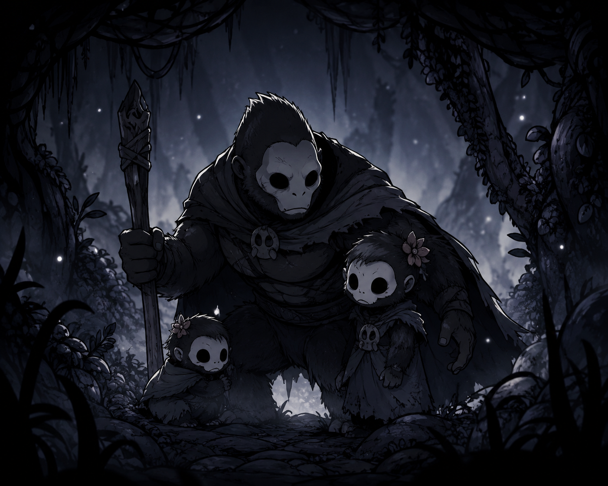

# Metroidvania

  

# Metroidvania

Projeto de jogo 2D desenvolvido em Unity e C#.

## Sobre

Projeto acadêmico focado no desenvolvimento de mecânicas de plataforma, exploração, combate e inteligência artificial de inimigos.

## Recursos atuais

- Movimentação do jogador
- Sistema de plataformas
- Inimigos patrulhando
- Inimigos perseguindo o jogador
- Coletáveis
- Portais

## Tecnologias

- Unity 6
- C#
- Visual Studio Code

## Desenvolvedor

Rafael Alves

Estudante de Jogos Digitais - Fatec Americana
